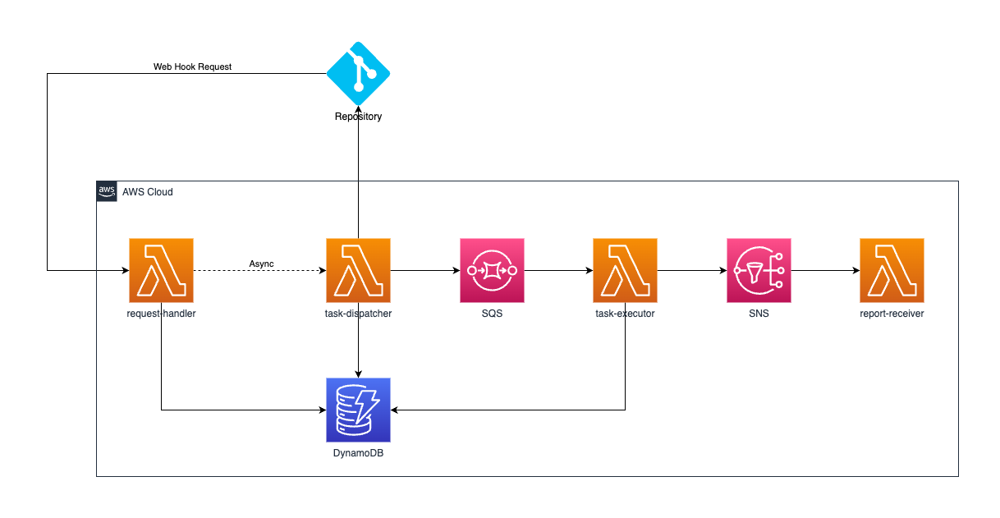

# Code Reviewer

## 1. 项目介绍

这是一个通过Bedrock进行代码评审的解决方案。通过把项目的代码、设计的原则、评审的规则、输出的要求等信息组织成为提示词，交给大模型来分析，大模型可以给出许多有建设性的意见。

本解决方案打通了常见的代码仓库，只需要简单的安装，便可在AWS云上构建出一套无服务器的代码评审框架，在代码仓库发生诸如push、merge等事件的时候，Web Hook调用本方案所创建的api接口，从而进行任务拆解，依次通过Bedrock调用大语言模型，并最终形成代码评审报告。

## 2. 安装过程

安装过程请参看文档《[CloudFormation安装法](INSTALL.md)》

说明：
- 如果你只是使用本方案，或者进行简单微调（例如：修改Lambda代码），CloudFormation的安装方法是适合的
- 如果你希望二次开发本方案，进行持续迭代，推荐通过CDK方式安装，可参看文档《[CDK安装法](INSTALL-CDK.md)》

## 3. 项目架构



## 4. 代码结构

```
.
├── INSTALL.md                      # Installation doc
├── README.md                       # Main doc
├── bin
│   └── code-reviewer.ts            # CDK main
├── cdk.json
├── jest.config.js
├── lambda
│   ├── base.py                     # 基础功能包
│   ├── codelib.py                  # 代码仓库相关代码，内部可引用gitlab_code, github_code, codecommit_code等模块实现具体代码仓库功能
│   ├── data_initializer.py         # 初始化代码
│   ├── gitlab_code.py              # Gitlab相关代码
│   ├── report.py                   # 用于产生Report的相关代码
│   ├── report_receiver.py          # 接收SNS消息，发送demo邮件，也可以发送飞书、钉钉、企业微信消息，或者其他自定义动作
│   ├── report_template.html        # Code Review Report模板，这个文件本身就可以打开预览哦
│   ├── repos.json                  # 用于初始化repository表的数据
│   ├── request_handler.py          # 代码仓库Webhook接收函数
│   ├── rules.json                  # 用于初始化rule表的数据
│   ├── task_dispatcher.py          # 任务拆解者，拆解成子任务放入SQS，每一个子任务对应一次Bedrock调用
│   └── task_executor.py            # SQS消费者，每一个消息对应一次Bedrock调用
├── layer
│   └── layer.zip                   # Lambda需要的Layer
├── lib
│   ├── api-stack.ts                # API Gateway & Lambda 相关CDK代码
│   ├── bucket-stack.ts             # S3相关CDK代码
│   ├── code-reviewer-stack.ts      # CDK代码主入口
│   ├── database-stack.ts           # Dynamodb相关CDK代码
│   ├── sns-stack.ts                # SNS相关CDK代码
│   └── sqs-stack.ts                # SQS相关CDK代码
├── package-lock.json
├── package.json
├── scripts
│   ├── invoke_bedrock_youself.py   # 根据Payload调用Bedrock的脚本
│   └── mock_codelib_event.py       # 模拟代码仓库事件的脚本
└── tsconfig.json
```

## 5. Lambda函数介绍

方案部署后会产生多个Lambda函数，会以部署时的Project Name参数作为前缀。例如Project Name=sample-project，则数据初始化Lambda名称为`sample-project-data-initializer`

- **{project_name}-data-initializer**

	在解决方案安装的时候，进行数据库初始化的Lambda函数。将以lambda/下repos.json和rules.json作为数据源对`{project_name}-repository`和`{project_name}-rule`表进行初始化。

	对应代码`/lambda/data_initializer.py`

- **{project_name}-request-handler**

	此Lambda函数接收代码仓库Webhook的请求，根据`{project_name}-repository`表中的配置，异步调用`{project_name}-task-dispatcher`函数，`{project_name}-repository`表关键信息将作为`{project_name}-task-dispatcher`函数event的一部分。

	本函数不直接处理业务，只会尽快向代码仓库给出响应。

	对应代码`/lambda/request_handler.py`

- **{project_name}-task-dispatcher**

	此Lambda函数会获取代码仓库的代码，并根据`{project_name}-rule`表中的配置，分解成多个子任务，每个子任务代表了一次Bedrock的调用。子任务信息将被发送给SQS。

	任务拆解的最后，将会产生一个特殊的type=checker的子任务，用于定期检查整个code review request的进度。

	对应代码`/lambda/task_dispatcher.py`

- **{project_name}-task-executor**

	此Lambda函数将读取SQS中消息，执行Bedrock操作并更新`{project_name}-task`表的状态。

	每次Bedrock任务完成后，都会检查整个code review request是否已经全部完成，整体任务完成时将在S3产生Code Review Report，并把结果发送给SNS。

	SQS中有一类type=checker的消息，每10秒执行一次，执行后将被重新放入SQS。这类消息用于检测code review request是否已经完成，超过10分钟都没有完成的code review request将被认定为超时，此时也将以阶段性结果来产生Code Review Report，并把结果发送给SNS。

	对应代码`/lambda/task_executor.py`

- **{project_name}-report-receiver**

	此Lambda函数读取SNS中消息，通过设定的SMTP参数向设定的邮件接收者发送报告。

	对应代码`/lambda/report_receiver.py`

## 6. 如何微调

- **代码评审报告希望改一种HTML展现方式，怎么办？**

	如果通过CDK部署方案，可以改写`report.py`；如果通过CloudFormation部署方案，可以改写`{project_name}-task-executor`中的`report.py`并重新部署。

	report.py文件负责产生报告，你可以改写这个文件中的`generate_report`方法实现自定义报告。

- **评审报告存储位置希望做调整，怎么办？**

	如果通过CDK部署方案，可以改写`report.py`；如果通过CloudFormation部署方案，可以改写`{project_name}-task-executor`中的`report.py`并重新部署。

	report.py文件负责产生报告，并且存储在S3，你可以改写这个文件中的`get_json_directory`和`generate_report`方法实现自定义存储。

- **代码评审结果想要发送给微信、飞书、钉钉应该怎么办？**

	可以写一个Lambda函数订阅方案中的SNS，通过消费SNS消息获取代码评审结果，然后通过微信、飞书、钉钉的WebHook进行API调用。

	你也可以通过改写`{project_name}-report-receiver`来实现这个需求。

- **对于整库代码评审，项目放不进去怎么办？**

	对于中小型项目，全部代码放入提示词，不会超过200K窗口大小。

	对于大型项目，可以分模块进行代码评审，每次仅仅把基础模块和其中一个业务模块交给Bedrock进行代码评审。

	可以在.codeview.yaml中增加类似于`modules`的key，在`rule`表中增加`module`类型的评审规则，在`task-dispatcher`对任务进行拆分的时候，根据module信息获取对应的代码，组装成消息放入SQS。

## 7. FAQ

- **向SQS发送了什么数据？**

	在CloudWatch中查询`/aws/lambda/{project_name}-task-dispatcher`日志组，过滤关键字`"Prepare to send message to SQS"`可以找到编码前的SQS消息，过滤关键字`"Succeed to send message to SQS"`可以找到SQS实际消息（Base64编码）。

- **向Bedrock请求了什么，Bedrock响应了什么？**

	在CloudWatch中查询`/aws/lambda/{project_name}-task-executor`日志组，过滤关键字`Bedrock - Invoking claude3`可以找到请求Bedrock的内容，过滤关键字`Bedrock - Claude3 replied`可以找到Bedrock响应的内容。

	日志`Bedrock - Invoking claude3 for task(xxx): {payload}`中，payload部分为发送给Bedrock的payload，如果你希望自己尝试调用Bedrock，可以使用以下程序，注意替换payload的指即可。

	```python
	import json, boto3

	payload = {} # Replace this payload

	#modelId = 'anthropic.claude-3-opus-20240229-v1:0'   # For Opus
	modelId = 'anthropic.claude-3-sonnet-20240229-v1:0'  # For Sonnet
	#modelId = 'anthropic.claude-3-haiku-20240307-v1:0'  # For Haiku

	bedrock_runtime = boto3.client('bedrock-runtime')
	response = bedrock_runtime.invoke_model(body=json.dumps(payload).encode('utf-8'), modelId=modelId)
	response_text = response['body'].read().decode('utf-8')

	print('Response:', response_text)
	```

	这份代码也可以在Github中`scripts/invoke_bedrock_youself.py`找到。

- **我的代码仓库有白名单要求怎么办？**

	需要把所有Lambda都放入一个VPC里面，然后在VPC中设置NAT Gateway可具有固定IP访问外部资源，将该IP配置在你的代码仓库白名单中。

	由于你可能已经在某些VPC中新建过NAT Gateway，为节省了成本，本解决方案不会自动创建VPC和NAT Gateway。你需要自行完成上述配置过程。

- **可以实现对提交代码的拦截吗？**

	本解决方案目前不支持，但是你可以自行改造以支持这个能力。

	另外，这个能力需要通过pre-receive hook实现，要求是代码仓库的本地部署版本，例如：self-managed instances of GitLab, GitHub Enterprise Server

	然后你需要改造`{project_name}-request-handler`，让他直接调用Bedrock实现代码评审。

## 8. 故障排除

- **Missing Authentication Token**

	检查WebHook请求时是否携带X-API-KEY这个headers

- **Forbidden**
	
	检查WebHook请求地址是否正确，检查请求方法是否POST

- **403响应**

	可以根据Webhook的Request Detail内容，参考《[如何排查 API Gateway 中的 HTTP 403 错误](https://repost.aws/zh-Hans/knowledge-center/api-gateway-troubleshoot-403-forbidden)》来排查。

- **Project Not Found**

	检查WebHook是否配置了Secret token

- **跑不通怎么办？**

	查查CloudWatch上的apigateway、lambda的日志，查查dynamodb表的数据状态

	Log Group如下：
	- API-Gateway-Execution-Logs_{api_gateway_id}/prod：其中{api_gateway_id}需要自行查出
	- /aws/lambda/{project_name}-request-handler
	- /aws/lambda/{project_name}-task-dispatcher
	- /aws/lambda/{project_name}-request-handler
	- /aws/lambda/{project_name}-request-handler

- **代码仓库进行push或merge操作无法触发code review**

	可参看《[CloudFormation安装法 - 验证](INSTALL.md#验证)》一节，检查必要的日志是否出现，又或者出现了什么错误日志。

	例如：

	- `{project_name}-request-handler`日志中查找类似于`Received Gitlab event[xx]: ...`的日志，检查event的值是否能触发后续流程。
	
	- `{project_name}-request-handler`日志中查找类似于`Parsed code review mode(xx) for branch(xx) by configuration ...`的日志，检查获取到的`{project_name}-repository`表的数据是否能触发后续流程。

	- `{project_name}-request-handler`日志中是否存在类似于`Fail to process`或`skip the processing.`的日志，明确表示失败。
	
	- 等等。
